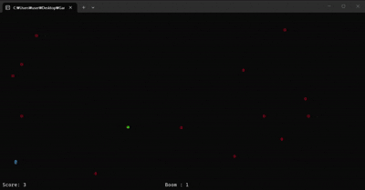

# C++ 콘솔 탄막 슈팅 게임 (Solo Project)

게임 루프(Tick), 콘솔 렌더링을 위한 더블 버퍼링, 탄막 생성 및 충돌 처리, 객체 생명주기 관리 등을 직접 구현한 프로젝트입니다. 이를 통해 객체지향 구조 설계와 메모리 관리 방식을 실습해 볼 수 있었습니다.

## 프로젝트 정보
- **개발 기간:** 2026.02.05 ~ 2026.02.10
- **개발 인원:** 1인
- **사용 기술:** C++
- **플랫폼/환경:** Windows Console

---

## 프로젝트 아키텍처 및 디렉토리 구조
게임 루프, 렌더링, 입력 처리와 게임 로직을 분리하여 구조를 설계했습니다.

---

## 핵심 구현 시스템 (Key Features)

### 1. 전역 탄막 제어 및 효율적인 메모리 관리 (`BulletSpawner`)
- **디자인 패턴:** `BulletSpawner`를 **싱글톤(Singleton)** 패턴으로 구현하여 전역에서 일관되게 탄막을 생성 및 제어할 수 있도록 설계했습니다.
- **다양한 탄도 알고리즘:** 곡선형 탄막 구현을 위해 **삼각함수**를 활용한 좌표 연산을 적용하였으며, 플레이어의 위치를 실시간 추적하는 유도탄(`HomingBullet`)과 다양한 탄막 패턴을 구현했습니다.

### 2. 정밀 이동 및 전략적 아이템 시스템
- **정밀 이동 모드 (Precision Movement):** 기본 방향키 이동 외에도 `Spacebar` 홀딩 시 플레이어의 이동 속도를 의도적으로 감속시켜, 밀도 높은 탄막 사이를 정밀하게 회피할 수 있는 UX를 제공합니다.
- **인벤토리 및 자동 발동 로직:** 획득 시 즉시 발동하는 '무적 아이템(2초)'과 `Q`키로 수동 사용하거나 피격 시 생존을 위해 자동 발동되는 '탄막 제거 아이템' 시스템을 통해 게임의 전략적 요소를 더했습니다.

### 3. 콘솔 환경 최적화 및 UX 안정성
- **더블 버퍼링(Double Buffering):** 콘솔창의 고질적인 문제인 화면 깜빡임(Flickering) 현상을 해결하기 위해 더블 버퍼링 스크린 클래스를 구축했습니다.
- **윈도우 콘솔 제어:** 플레이 중 화면 왜곡을 방지하기 위해 콘솔 창 최대화 방지 및 실시간 스코어 HUD 렌더링 시스템을 구현했습니다.

---

## 트러블슈팅 및 기술적 도전 (Troubleshooting)

### 레벨 전환 시 싱글톤 참조로 인한 댕글링 포인터(Dangling Pointer) 크래시
- **문제 상황:** 게임 오버 또는 스테이지 전환 시 간헐적으로 프로그램이 예기치 않게 종료되는 메모리 접근 오류 크래시가 발생했습니다.
- **원인 분석:** 레벨이 교체되면서 기존 레벨 내의 객체들(`Bullet`, `Item` 등)이 메모리에서 해제되었으나, 전역에서 유지되는 싱글톤 객체인 `BulletSpawner`의 `activeBullet` 리스트가 파괴된 객체들의 유효하지 않은 과거 메모리 주소를 여전히 가리키고 있는 댕글링 포인터 현상이 원인이었습니다.
- **해결 과정:** C++ 객체 소멸자의 호출 순서와 자체 게임 루프의 실행 라이프사이클을 면밀히 분석했습니다. `~GameLevel()` 소멸자 시점에 스포너 내의 참조 리스트만 안전하게 걷어내는 `ClearPointerListOnly()` 로직을 선제적으로 실행하도록 조치했습니다.
- **개선 결과:** 객체 간의 의존성을 정리한 후, 엔진 메인 루프의 마지막 단계에서 메모리를 해제하도록 지연 삭제 방식을 적용했습니다.
이를 통해 레벨 전환 과정에서 발생하던 메모리 접근 오류를 해결하고, 객체 생명주기를 보다 명확하게 관리할 수 있도록 구조를 개선했습니다.

---

## 프로젝트 회고 및 발전 방향

### 성과 및 배운 점
- **메모리 라이프사이클 체득:** 포인터와 소멸자, 그리고 동적 할당된 객체의 생성·소멸 시점을 관리하면서 객체 생명주기의 중요성을 이해할 수 있었습니다.
- **논리적 사고력 훈련:** 프레임마다 오브젝트의 좌표를 직접 계산하며 Tick 기반 업데이트 구조와 탄막 패턴 구현 방식을 학습했습니다.

### 한계점 및 차기 프로젝트 적용 계획 (Action Item)
- **높은 결합도:** 타이트한 기간 내에 기능을 구현하다 보니 `Actor`, `Level`, `Manager` 간의 의존성이 높아져, 기믹이 추가될수록 코드가 복잡해지는 한계를 체감했습니다. 객체지향 디자인 패턴과 아키텍처 분리의 필요성을 명확히 이해하게 되었습니다.
- **차기 과제:** 본 프로젝트에서 체감한 아키텍처적 한계를 발판 삼아, 다음 프로젝트에서는 클래스 간의 결합도를 낮추는 설계를 최우선으로 두고, **대량의 오브젝트 충돌 연산을 최적화할 수 있는 공간 분할 알고리즘**을 도입하여 시스템을 한 단계 더 확장할 계획입니다.
